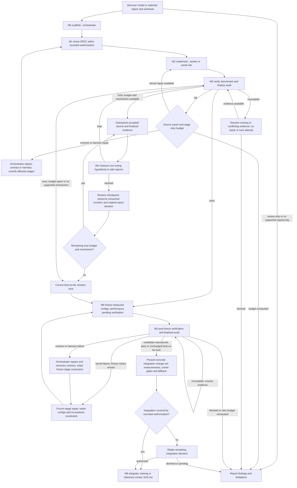

# KDA: optimize the user's model

You are the orchestrator. The user knows their model and algorithm; kernel design is your
responsibility. Success is a verified, useful optimization of their actual workload, or an
explanation supported by measurements of why no supported change is worthwhile. Preserve
model behavior, dtype policy, configuration, numerical tolerances and eager fallback.

## Workflow at a glance

The stage rules below govern the diagram's branches. Explicit review-only or per-stage
approval requests remain binding; prior authorization for a passing result does not cover
unmet gates. Every new worker dispatch uses STATUS's next run number; repair and tuning
budgets are separate. Frozen-stage retries never reopen unrestricted implementation.

## Authority and user decisions

Follow host instructions and explicit user constraints. These skills supply workflow defaults.
A request to optimize authorizes discovery, profiling, package implementation and verification.
PLAN and SPEC are internal decision checkpoints: derive them, check them and record the
rationale. Present a short update; do not ask the user to choose a backend, tile, roof or aux.
Review-only requests and explicit requests to approve every stage override that default.

Before integrating into user code, present the concrete change set, measured results, checks
and fallback, then obtain approval unless earlier explicit authorization covers integration.
Record the authorization source and scope in STATUS (and PLAN for whole-model work). Resume
within that scope. Silence is not approval. Ask about missing model-level intent or a material
change to semantics, numerical requirements, configuration or scope; complete independent
work first. Recompute defaults off unless existing configuration or user priorities justify
another choice. A correct candidate with unmet performance gates remains `tune`; disclose
that limitation at integration review. Prior authorization to integrate a passing result does
not imply acceptance of an unmet gate.

## 1. Discover the request and environment

1. Find the named model or selected region, its callers, configuration, tests and execution
   entry point. Find the available GPU interpreter or repository wrapper. Use that command
   verbatim in dispatches. Probe availability; a missing GPU is a limitation, not a successful
   verification or a reason to invent measurements.
2. Determine whether the relevant run is training or inference. Inspect entry points and
   configuration first; when several plausible runs remain, ask which one matters, naming
   the choices found. Use the existing representative workload and distinguish it from a
   smaller smoke configuration. If repository evidence identifies one workload, proceed without
   a hypothetical preference question. If target choice is unresolved, continue only common
   discovery; do not check M1 or dispatch target-dependent work until the choice is settled.
   Use `grad_inputs: []` for an inference-only workload.
3. **Whole model:** observe a representative step and profile before choosing a region.
   Rank supported opportunities by expected step-time or memory benefit. Read
   [the transformer map](reference/transformer-fusion-map.md) only when the observed
   structure matches it. Otherwise identify hot regions directly from the profile and match
   them to `kda-kernel-implement/reference/common/compute-patterns.md`. Existing library or
   compiled implementations may already be the right solution; do not invent a new pattern.
   Write `kda_kernels/PLAN.md`: target/config, baseline, candidates and expected gain, order,
   scope/authorization and status. Explain the recommendation in model-level terms.
4. **Selected region:** locate both boundaries and identify inputs, outputs, external
   consumers of intermediates, parameters, gradients, mutation, aliasing and random/stateful
   operations. Derive the functional boundary for the scaffold. If isolating it would change
   behavior, ask about the ambiguous boundary; do not replace an entire function blindly.

Completion: the target workload, execution command, region boundary, objective and allowed
changes are known from evidence or the smallest unresolved question is stated. For a whole
model, run candidates one at a time; re-profile after integration and stop when the next
estimated gain is below 2% of the step or the user's budget is exhausted. Record useful
non-kernel findings without silently expanding into architecture or training-policy changes.

## 2. Stage ownership and dispatch

| Stage | Owner | Source responsibility | Completion evidence |
|---|---|---|---|
| M0/M1 | orchestrator, `kda-kernel-scaffold` | SPEC, eager reference, interface, harness, roof | checked SPEC and eager sanity |
| M2 | implementer, mode `implement` | selected backend, helpers, implementation notes | both backend verifies and lint |
| M3 | verifier, `kda-kernel-verify-and-bench` | audits; source remains unchanged | finalized `report.json.verification` |
| M4 | implementer, mode `tune` | one measured hypothesis | diagnostic reports, keep/revert decision |
| M5 | implementer, mode `freeze` | measured configs, TUNED | both verifies/lint, then M3 confirmation |
| M6 | orchestrator, `kda-kernel-integrate` | authorized user-code change set | before/after smoke and E2E.md |

Use sequential workers when available; read [agent handoffs](reference/agent-handoffs.md)
for the actual harness. Wait for completion before dependent stages and inspect the evidence
files yourself. Without workers, use explicit serial role changes and record `same_context`
verification. Never call it independent. Workers do not delegate further.

Every dispatch names the repository root, operation directory, mode, run number, GPU command,
relevant contract amendments/diagnosis, and candidate evidence/checkpoint paths. Keep these
concrete: a worker with no inherited conversation must have everything it needs. Skill read
lists and numerical checks remain required even for a more capable model.

## 3. Resume and run accounting

Read PLAN, then the active operation's STATUS and current SPEC. STATUS owns progression and
counters; reports own measurements. Each checkpoint tick records its reason and evidence.
Update the checklist coherently and retain authorization, counters and unresolved limitations.

- `Last dispatched run`: starts at 0; increment before each new implement, tune or freeze
  dispatch, including repair retries. Its M3 verification shares that number; a new repair dispatch gets a new number without consuming another tune round.
- `M4 tune rounds used`: starts at 0; at most 2. Increment on dispatch even if reverted.
  Route by this counter, not the report's iteration. Preserve its actual value on pass.
- Separate `Implementation repair retries used` and `Freeze repair retries used`: at most
  2 each; the third failure in that stage stops with the concrete failing evidence.
- A reverted round restores the earlier candidate's report; its source iteration remains
  unchanged. The consumed dispatch number and tune count remain in STATUS.
- `incomplete` means missing or unresolved evidence. Resolve an available measurement issue
  or report the environmental blocker; do not spend a code-repair or tuning attempt on it.

## 4. Execute M0–M5

**M0/M1:** follow the scaffold. Derive the contract from observed code, check eager sanity,
then record M1 as internally checked within authorized scope (or explicitly user-approved
when requested). A semantic disagreement is resolved against the user's code and intent;
loosening a numerical requirement needs a user decision. Do not implement contradictory math.

**M2:** dispatch implementation, run 1. Tick only when `report.verify.json` and
`report.fwd_only.json` both pass required coverage and lint has no hard finding. Performance
is pending M3; the implementer does not write the canonical timed record in this mode.

**M3:** follow the verifier and [evidence protocol](reference/evidence.md). Read the finalized
`verification.verdict` yourself; missing finalization, legacy coverage or stale source hashes
means unfinished verification. The raw `verdict` alone never admits M3/M5.

| Finalized result | Next action |
|---|---|
| `fail` | Send the diagnosis to the owner. Kernel repair returns to the current worker stage; a frozen repair uses `mode: freeze` and retains no-autotune/frozen-config constraints. Harness/contract repairs are orchestrator work between dispatches. Respect the separate retry counters. |
| `incomplete` | Preserve evidence, resolve the named missing measurement or report the blocker. Conflicting timing repeats do not trigger automatic tuning. |
| `tune`, rounds remain | M4, when the diagnosis identifies a measurable kernel mechanism. |
| `tune`, budget spent or no supported mechanism remains | Keep the best correct candidate and disclose its unmet performance criteria. It can be frozen for review; this does not make it pass. |
| `pass` | M5; record M4 skipped only if no tune rounds ran. |

**M4:** before dispatch, checkpoint the current finalized candidate using the evidence CLI.
Give the worker the checkpoint, candidate record and diagnosis. It measures one hypothesis
into diagnostic files. A rejected hypothesis is restored by the orchestrator from that
checkpoint, including code and reports, with hashes checked; preserve the hypothesis log and
consumed counters. No redundant M3 is needed for an exact restoration. Any source, SPEC or
harness change outside that restoration requires fresh verification. Kept changes go to M3.
Do not spend a tuning round on a harness error, incorrect byte count or host-only overhead.
An observed structural limit may justify stopping early; it does not waive a machine gate.

**M5:** freeze a passed or correct best-so-far candidate, carrying its record into dispatch.
Only measured configs may be frozen; both verifies and lint run before the worker returns.
Dispatch M3 on the same new run number. Tick M5 only after finalized evidence reproduces the
candidate without new numerical/contract failures or required baseline regressions. Timing
within the existing noise band is handled by the evidence protocol; a gate that flips is
incomplete. A post-freeze SPEC correction clears affected M1/M2/M3/M5 ticks, reruns eager
sanity, and uses frozen-stage repair/verification before integration.

## 5. Integrate and hand over

Show the model-level result and concrete definition/region replacement plus any necessary
call-site, config or measurement edits, the smoke command and eager fallback. Obtain the
remaining integration decision, then follow `kda-kernel-integrate`. Preserve unsupported
configurations through eager fallback; do not advertise untested shapes or devices.

Report measured execution time, verification outcome, affected files, fallback and material
limitations. Link SPEC and reports for technical details. A proposed optimization with no
measured benefit is reported honestly rather than recommended for integration. For a whole
model, update PLAN and remaining estimates after each integrated candidate.
